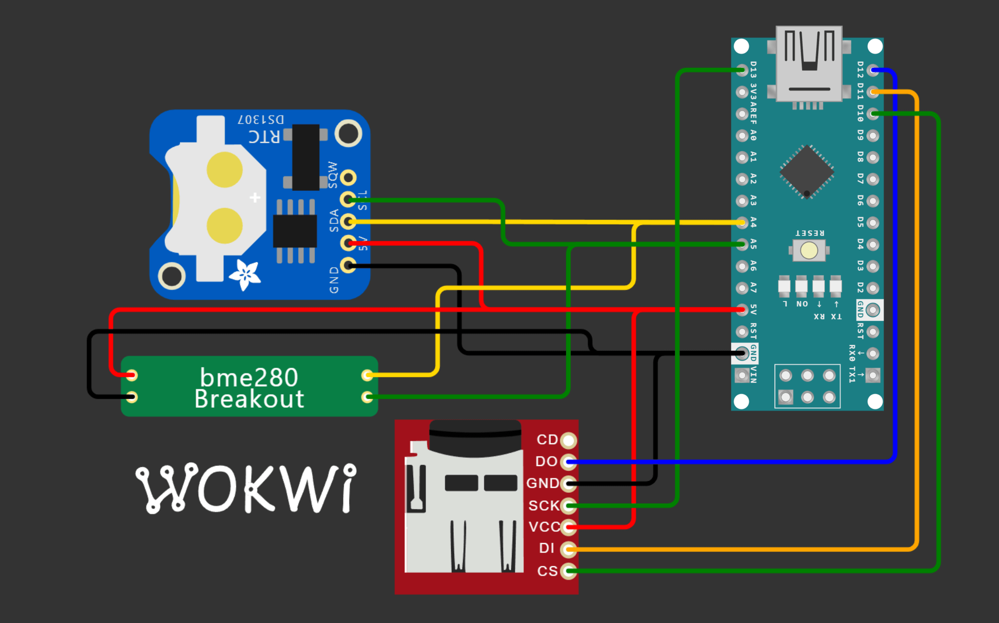

# Simple bme280 logger
An arduino nano based bme280 logger logs all data to an sd card with time form a DS1307 module in csv format.

Parts needed:
- Arduino nano or other arduino compatable board
- bme280 module
- DS1307 RTC clock
- SD card module

## Hardware setup
To setup the arduino nano board connect to 

- BME280
    - VCC 5V
    - GND GND
    - SDA A4
    - SCL A5
- DS1307
    - VCC 5V
    - GND GND
    - SDA A4
    - SCL A5
- SD card module
    - VCC 5V
    - GND GND
    - CS D10
    - SCK D3
    - MOSI D11
    - MOSO D12

## Firmware setup
For this project you can flash your board throw a precompiled hex with a tool like [ArduinoSketchUploader](https://github.com/twinearthsoftware/ArduinoSketchUploader). You can find the precompile hex Here: [Github Releases](https://github.com/luke-e-gibson/bme280Logger/releases/tag/v1-beta). Not all board have a precompiled firmware and you will have to compile your self throw [platformIo](https://platformio.org/) in vscode.

